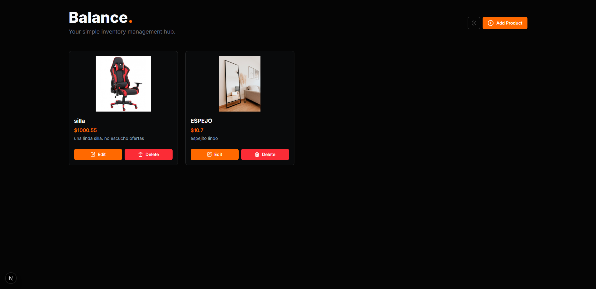

# Balance ⚖️ - Simple Inventory Manager

**Balance** is a full-stack CRUD (Create, Read, Update, Delete) web application built with Next.js and Supabase. It allows users to manage a product inventory through a clean, simple, and visual interface that supports both light and dark modes.

## Live Demo 🌐

You can view the deployed project and test it live at the following link: **[https://balance-pink.vercel.app](https://balance-pink.vercel.app)**

---

## Key Features ✨

* **Product Management (CRUD):**
    * **Create:** Add new products via a modal-based form.
    * **Read:** View all products on a responsive grid.
    * **Update:** Edit the information of an existing product, including its image.
    * **Delete:** Remove products from the inventory with a confirmation prompt.
* **Image Uploads:** Integrated with Supabase Storage to host product images.
* **Light & Dark Mode:** A functional theme switcher with smooth transitions for an enhanced user experience.
* **Responsive Design:** The interface adapts seamlessly to various screen sizes, from mobile to desktop.
* **Modern UI:** Built with Tailwind CSS for rapid and customizable styling, complete with subtle animations.

---

## Tech Stack 🛠️

* **Framework:** Next.js (App Router)
* **Language:** TypeScript
* **Styling:** Tailwind CSS
* **Backend & Database:** Supabase (PostgreSQL & Storage)
* **UI/UX:**
    * React Hooks
    * `next-themes` for theme management.
    * `lucide-react` for icons.
* **Deployment:** Vercel